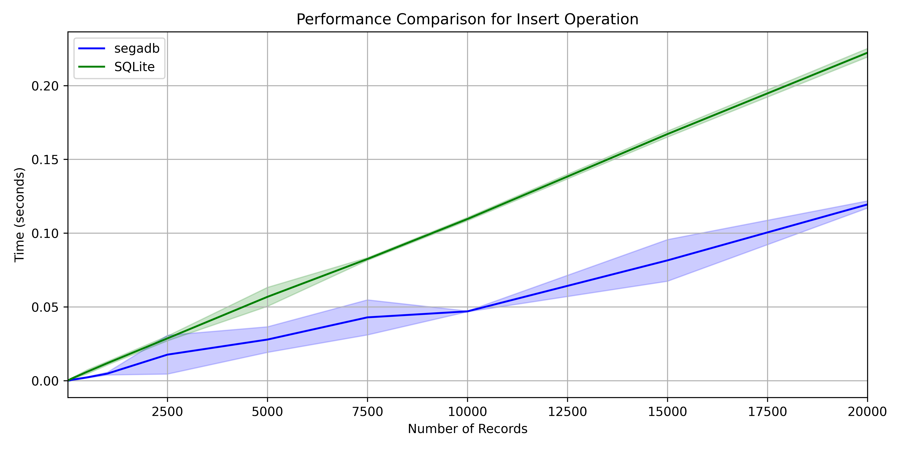
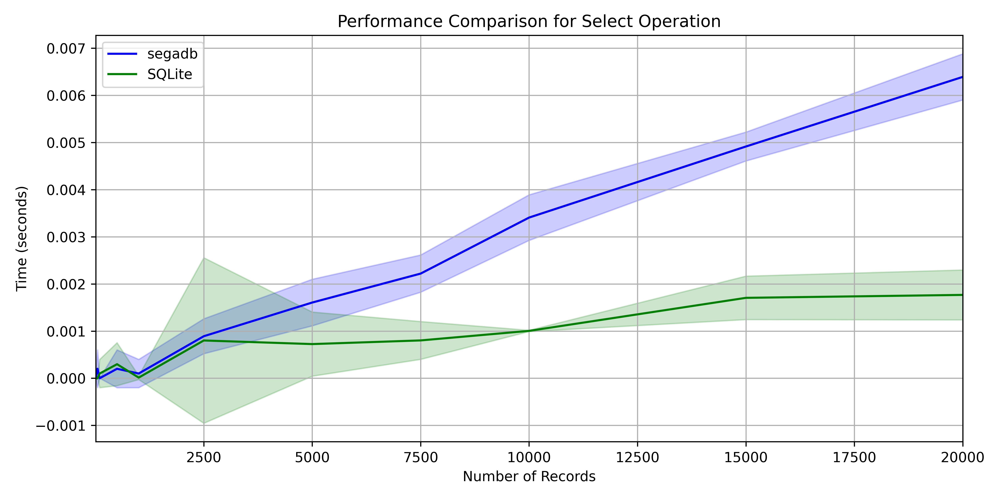
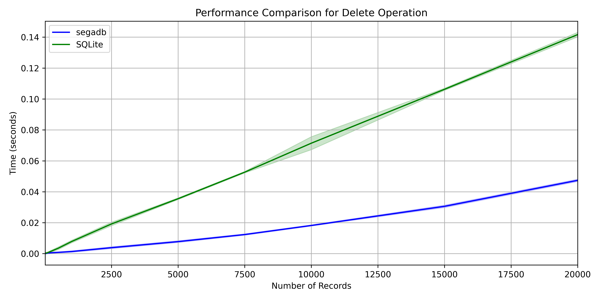

# SEGADB

SEGADB is a simple database library for Python.
This project is primarily educational. It is designed to help understand the workings of a simple database system by building it from scratch. The implementations focus on fundamental concepts first and then on optimizing for speed or robustness, using basic Python data structures and custom transaction handling for specific tasks.

In order to achieve this, the project is divided into several modules that handle different aspects of a database system, such as managing tables, records, transactions, and storage. The library provides a simple interface for creating, updating, and querying data, as well as managing users, views, and constraints.

The project also includes example scripts that demonstrate how to use the library for various tasks, such as creating tables, adding constraints, inserting data, performing queries, and managing views. The examples cover a wide range of functionalities, from basic operations to more advanced features like encryption, indexing, and partial database loading.

The library is designed to be extensible and customizable, allowing users to define their own record types, constraints, and indexing strategies.
While the library is not intended to be a full-fledged database management system, it provides a solid foundation for understanding the core concepts of database systems and building more complex systems on top of it. While work has been done to optimize the library for performance, it is still a work in progress and may not be suitable for production use.

Since the project is educational, learning and understanding how databases work, third-party libraries are used sparingly. However, the project does use the following third-party libraries:
- `bcrypt`: Used for hashing and verifying passwords for user authentication.
- `cryptography`: Used for encrypting and decrypting data with our custom Fernet implementation.
- `tabulate`: Used for formatting tables in the console output. (Will be removed in the future)
- `PIL` (Pillow): Used for working with images in the ImageRecord class.
- `tqdm`: Used for progress bars in large data processing.
- `faker`: Used for generating fake data for testing purposes.
- `Flask`: Used as the web framework for the React Web App's backend API.
- `Flask-CORS`: Used to handle Cross-Origin Resource Sharing for the Flask API.

The database library provides the following interfaces:
1.  **Python API**: Directly use the library's Python modules (`segadb.*`) for database operations.
2.  **Socket API**: Launch a database server from a `.segadb` file (`segadb/launch_server.py`) and interact with it using a socket client (`segadb/socketClient.py`).
3.  **Curses Interface**: Navigate through the database in the console with the DB Navigator (`segadb/db_navigator.py`). (Read-only)
4.  **Web GUI (React + Flask)**: A web interface built with React (frontend) and Flask (backend API) for interacting with the database via the Socket API. See [`web_app_react/`](web_app_react/).

## Table of Contents
<!-- Add Links to Other Sections Here! -->
- [Features](#features)
- [Installation](#installation)
- [Usage Examples](#usage-examples)
- [Web Application](#web-application)
- [CLI Tool](#cli-tool)
- [Scripts](#scripts)
- [Documentation](#documentation)
- [Tests](#tests)
- [Performance Comparisons](#performance-comparisons)
- [File Structure](#file-structure)

## Features
- **Database Management**: Create, drop, copy, restore, and add constraints to database. See [`Database`](segadb/database.py).
- **Partial Database Loading**: Load only the necessary tables from a database file into memory. See [`DatabasePartial`](segadb/databasePartial.py).
- **Table Operations**: Insert, update, delete, and select records in a table. See [`Table`](segadb/table.py).
- **Transaction Handling**: Support for transactions with commit and rollback functionality. See [`Transaction`](segadb/transaction.py).
- **Indexing**: Create and manage indexes for efficient data retrieval. See [`Index`](segadb/index.py).
- **Storage**: Save and load the database to and from a file (`.segadb`). Create and restore from backups. See [`Storage`](segadb/storage.py).
- **Record Management**: Manage individual records with unique IDs and data. See [`Record`](segadb/record.py).
    - Support for **Vector Records**: `magnitude()`, `normalize()`, `dot_product()`.
    - Support for **Time Series Records**: `moving_average()`.
    - Support for **Image Records**: `image_data`, `image_path`, `image_size`, `get_image()`, `resize()`, base64 handling.
    - Support for **Text Records**: `word_count()`, `to_uppercase()`, `to_lowercase()`.
    - Support for **Encrypted Records**: `decrypt()`.
- **User Management and Authorization**: Manage users, their roles, and permissions. See [`User`, `UserManager`, and `Authorization`](segadb/users.py).
- **View and Materialized View Management**: Create, retrieve, refresh, and delete views and materialized views. See [`View` and `MaterializedView`](segadb/views.py).
- **Stored Procedures and Triggers**: Create and use stored procedures and triggers. See [`Database`](segadb/database.py) methods.
- **Constraints**: Add and enforce constraints (UNIQUE, FOREIGN KEY, custom lambda) on table columns. See [`Table`](segadb/table.py) `add_constraint`.
- **Logging**: Configurable logging for Database and Table level operations.
- **Cryptographic Support**: Encrypt and decrypt data using a custom Fernet implementation. See [`CustomFernet`](segadb/crypto.py).
- **Database Navigator (Curses)**: View the contents of the database in the console. See [`DB Navigator`](segadb/db_navigator.py).
- **Server and Client Communication**:
    - Launch a database server from a `.segadb` file. See [`launch_server.py`](segadb/launch_server.py).
    - Interact with the server using a socket client. See [`socketClient.py`](segadb/socketClient.py).
- **Web GUI (React + Flask)**: A modern web interface to interact with the database server. See [`web_app_react/`](web_app_react/).

## Installation

To set up the project environment, you can use the provided `environment.yml` file to create a conda environment with all the necessary dependencies.

1.  Open a terminal or command prompt.
2.  Navigate to the directory where your repository is located.
3.  Run the following command to create the conda environment: `conda env create -f environment.yml`
4.  Activate the newly created environment: `conda activate segadb_env`
5.  **For the React Web App:** Navigate to the `web_app_react/` directory and run `npm install` to install Node.js dependencies.

## Usage Examples

### Sample Database and Navigation
- [`example_sampleDB.py`](examples/example_sampleDB.py): Demonstrates how to create a sample database and navigate through it using the DB Navigator.
- [`example_dbNavigator.py`](examples/example_dbNavigator.py): Demonstrates how to navigate through a database using the DB Navigator.

### Backup and Recovery
- [`example_backupRecovery.py`](examples/example_backupRecovery.py): Demonstrates how to create and restore backups.

### Record Management
- [`example_change_ids.py`](examples/example_change_ids.py): Demonstrates how to change record IDs, difference between IDs and Index.
- [`example_recordTypes.py`](examples/example_recordTypes.py): Demonstrates how to use different record types (VectorRecord, TimeSeriesRecord, ImageRecord, TextRecord, EncryptedRecord).

### Constraints and Keys
- [`example_constraints.py`](examples/example_constraints.py): Demonstrates how to add and enforce constraints on table columns.
- [`example_foreignKeys.py`](examples/example_foreignKeys.py): Demonstrates how to use foreign key constraints.

### Data Operations
- [`example_databaseDetails.py`](examples/example_databaseDetails.py): Demonstrates how to create tables and manage records.
- [`example_dataExport.py`](examples/example_dataExport.py): Demonstrates how to export data to different formats: CSV, JSON, SQLite.
- [`example_dataImports.py`](examples/example_dataImports.py): Demonstrates how to import data from a CSV file.
- [`example_queries.py`](examples/example_queries.py): Demonstrates how to create tables, add constraints, insert data, perform joins, aggregations, and filtering operations.
- [`example_stored_procs.py`](examples/example_stored_procs.py): Demonstrates how to create and use stored procedures and triggers.

### Performance
- [`example_millionRowLoad.py`](examples/example_millionRowLoad.py): Demonstrates how to load a table with a million rows using multiprocessing.
- [`example_parallel_insert.py`](examples/example_parallel_insert.py): Demonstrates parallel record insertion into a table.
- [`example_partialDB.py`](examples/example_partialDB.py): Demonstrates how to load only the necessary tables from a database file into memory.

### Storage
- [`example_storage.py`](examples/example_storage.py): Demonstrates how to save and load the database, and check constraints.
- [`example_storageCompression.py`](examples/example_storageCompression.py): Demonstrates how to save and load the database with compression.
- [`example_storageCompressionLarge.py`](examples/example_storageCompressionLarge.py): Demonstrates how to save and load a large database with compression, using multiprocessing.

### Transactions
- [`example_transactions.py`](examples/example_transactions.py): Demonstrates how to use transactions for commit and rollback operations.

### User Management
- [`example_UsersAuth.py`](examples/example_UsersAuth.py): Demonstrates user authentication and authorization.

### View Management
- [`example_views.py`](examples/example_views.py): Demonstrates how to create, retrieve, refresh, and delete views and materialized views.

### Server/Client
- [`example_dbServer.py`](examples/example_dbServer.py): Example of starting the database server.
- [`example_dbServerClient.py`](examples/example_dbServerClient.py): Example of interacting with the database server using the socket client.

---
#### Here is a simple example of creating a segadb Database and a table with constraints.
```python
from segadb import *

# Create a new database
db = Database("MyTestDB")

# Create a new table
db.create_table("Users", ["name", "email"])

# Insert a record
users_table = db.get_table("Users")
users_table.insert({"name": "John Doe", "email": "john@example.com"})

print("Before Insert:")
users_table.print_table()

# Add a constraint to the table
users_table.add_constraint("email", lambda x: "@" in x)
print("\n--Constraint added to the table: email must contain '@'")

users_table.try_insert({"name": "Jane Doe", "email": "janeexample.com"})    # violates the constraint
users_table.insert({"name": "Jane Doe", "email": "jane@example.com"})       # satisfies the constraint

print("\nAfter Insert:")
users_table.print_table()

# Add constraint for unique email
users_table.add_constraint("email", "UNIQUE")
print("\n--Constraint added to the table: email must be unique")

# Try to insert a record with a duplicate email
users_table.try_insert({"name": "John Doe", "email": "john@example.com"})     # violates the constraint
users_table.try_insert({"name": "James Doe", "email": "james@example.com"})   # satisfies the constraint

print("\nAfter Insert:")
users_table.print_table()
```
```
Before Insert:
Record ID: 1, Data: {'name': 'John Doe', 'email': 'john@example.com'}

--Constraint added to the table: email must contain '@'
Constraint violation on column email for value janeexample.com
Error on insert: Constraint violation on column email for value janeexample.com

After Insert:
Record ID: 1, Data: {'name': 'John Doe', 'email': 'john@example.com'}
Record ID: 2, Data: {'name': 'Jane Doe', 'email': 'jane@example.com'}

--Constraint added to the table: email must be unique
Constraint violation on column email for value john@example.com
Error on insert: Constraint violation on column email for value john@example.com

After Insert:
Record ID: 1, Data: {'name': 'John Doe', 'email': 'john@example.com'}
Record ID: 2, Data: {'name': 'Jane Doe', 'email': 'jane@example.com'}
Record ID: 3, Data: {'name': 'James Doe', 'email': 'james@example.com'}
```

## Web Application

This project includes a web-based graphical user interface (GUI) built with **React** for the frontend and **Flask** for the backend API. This allows users to interact with the SEGADB database through a web browser.

-   **Location:** [`web_app_react/`](web_app_react/)
-   **Backend:** The Flask application (`web_app_react/app.py`) serves the React frontend and provides API endpoints (`/api/*`) that communicate with the SEGADB database server using the `SocketClient`.
-   **Frontend:** The React application (`web_app_react/src/`) provides the user interface components for logging in, viewing database objects (tables, views, materialized views), creating tables, inserting records, running queries, creating stored procedures (with caution!), and viewing database info.

### Running the Web Application

The easiest way to run both the database server and the web application is using the provided `start_servers.py` script:

1.  Ensure you have activated the `segadb_env` conda environment.
2.  Ensure you have installed Node.js dependencies (`npm install` in `web_app_react/`).
3.  Build the React app: Navigate to `web_app_react/` and run `npm run build`.
4.  Run the script from the project root:
    ```bash
    python start_servers.py <path_to_your_database.segadb>
    ```
    *(Replace `<path_to_your_database.segadb>` with the actual path to your database file, e.g., `example_storage/SampleDB.segadb`)*

This script will launch:
*   The SEGADB socket server using `segadb/launch_server.py`.
*   The Flask API server using `web_app_react/app.py`.

You can then access the web interface, typically at `http://localhost:5000` (check the output of `start_servers.py` for the exact URL).

## CLI Tool
A command-line tool for interacting with SegaDB databases.  
This CLI allows you to manage database instances either by interacting directly with local `.segadb` files or by connecting to a running SegaDB server via its socket interface.

### Features

*   Connect to local `.segadb` files or a remote SegaDB server.
*   Get database information (`info`).
*   Manage tables: `list`, `create`, `drop`, `query`, `insert`.
*   Manage users (remote server only): `create`.
*   Handle remote server authentication: `auth login`, `auth logout`.
*   Manage backups (local files only): `backup create`, `backup list`.
*   Control remote server: `server ping`, `server stop`.
*   Uses existing `segadb` package logic (`Storage`, `SocketClient`, etc.).
*   Handles basic error reporting and confirmation prompts.

## Scripts
The following PowerShell scripts are included in the `scripts/` folder to help with various tasks:

- [`_run_all_scripts.ps1`](scripts/_run_all_scripts.ps1): Runs all PowerShell scripts in the `scripts/` folder sequentially.
- [`todo_comments.ps1`](scripts/todo_comments.ps1): Finds and lists all TODO comments in Python files.
- [`count_lines.ps1`](scripts/count_lines.ps1): Counts the number of lines in each Python file, sorts the files by line count in descending order, and calculates the total number of lines.
- [`comment_density.ps1`](scripts/comment_density.ps1): Calculates the comment density (percentage of lines that are comments) in Python files.
- [`documentation_html.ps1`](scripts/documentation_html.ps1): Generates HTML documentation for Python files in the `segadb/` folder, and moves the generated HTML files to the `docs/` folder.
- [`documentation_md.ps1`](scripts/documentation_md.ps1): Generates markdown documentation for Python files in the `segadb/` folder.
- [`export_env.ps1`](scripts/export_env.ps1): Exports the conda environment to a YAML file. Remove the prefix from the environment name to make it compatible with other systems.
- [`segadb.ps1`](scripts/segadb.ps1): Helper script related to the `segadb` library (purpose might need clarification).
- [`web_app.ps1`](scripts/web_app.ps1): Helper script likely related to the older Flask web app.
- [`web_app_react.ps1`](scripts/web_app_react.ps1): Helper script likely related to the React web app.

## Documentation
### HTML Documentation
Pydoc documentation is generated from the PowerShell script `documentation_html.ps1`.
To see live version: https://santiagoenriquega.github.io/custom_database/segadb

Self host documentation, run the following command in the terminal: `python -m pydoc -p 8080`
Then open a web browser and navigate to http://localhost:8080/segadb.html

### Markdown Documentation
Pydoc Markdown is also available and is generated from the PowerShell script `documentation_md.ps1`.
The output file is located in [`docs/documentation.md`](docs/documentation.md)

## Tests
To run the tests, use the following command from the project root directory:
```bash
python -m unittest discover -s tests
```
Or run the combined tests script:
```bash
python tests/run_all_tests.py
```
### Test Results
The following are the results of running the tests:
*(Test results output remains the same as you provided)*
```sh
(segadb_env) PS ...\custom_database> python .\tests\run_all_tests.py
.........Testing Database Class
.........................................Testing DatabasePartial Class
.....Testing file: example_UsersAuth.py
.Testing file: example_backupRecovery.py
.Testing file: example_change_ids.py
.Testing file: example_constraints.py
.Testing file: example_dataExport.py
.Testing file: example_dataImports.py
.Testing file: example_databaseDetails.py
.Testing file: example_dbNavigator.py
.Testing file: example_foreignKeys.py
.Testing file: example_millionRowLoad.py
.Testing file: example_parallel_insert.py
.Testing file: example_partialDB.py
.Testing file: example_queries.py
.Testing file: example_recordTypes.py
.Testing file: example_sampleDB.py
.Testing file: example_storage.py
.Testing file: example_storageCompression.py
.Testing file: example_storageCompressionLarge.py
.Testing file: example_stored_procs.py
.Testing file: example_transactions.py
.Testing file: example_views.py
.Testing Imports
..Testing Index Class
....Testing Record Class
.............Testing safe_execution decorator
.....Delete performance on 5000 [id, name, email] records: 0.011 seconds.
.Insert performance for 5000 [id, name, email] records: 1.0 seconds.
.Join performance for 5000 records: 3.1 seconds.
.Load performance for 5000 records: 1.0 seconds.
.Restore performance for 5000 records: 0.0 seconds.
.Save performance for 5000 records: 0.11 seconds.
.Select performance of 1 out of 5000 [id, name, email] records: 0.002 seconds.
.Update performance on 5000 [id, name, email] records: 0.49 seconds.
.Testing Storage Class
......................Testing Table Class
..................................................Testing Transaction Class
.......................
----------------------------------------------------------------------
Ran 203 tests in 69.413s

OK
```

## Performance Comparisons

The `performance_comparisons/performance_comparison.py` script is used to compare the performance of the SEGADB library with SQLite. The script measures the time taken for various database operations such as insert, select, update, aggregate, filter, sort, and delete.

### Results

The script generates performance comparison plots for each operation and saves them in the `performance_comparisons/` folder. The plots show the time taken for each operation with varying numbers of records.

### Example Plots

To see all the plots, navigate to the `performance_comparisons/` folder.
Here is the performance comparison plots for the insert, select, and delete operations:





## File Structure
The project directory structure is as follows:

```
custom_database-1/
├── .gitignore                  # Specifies intentionally untracked files that Git should ignore
├── environment.yml             # Conda environment definition file
├── pydoc-markdown.yml          # Configuration for pydoc-markdown
├── README.md                   # This README file
├── setup.py                    # Setup script for packaging the segadb library (TBD)
├── start_servers.py            # Script to launch DB server and Web App backend together
│
├── segadb/                     # Contains the core database library code
│   ├── __init__.py             # Initializes the segadb package, makes classes available
│   ├── crypto.py               # Implements the CustomFernet class for encryption/decryption
│   ├── database.py             # Implements the main Database class
│   ├── databasePartial.py      # Implements the PartialDatabase class for partial loading
│   ├── db_navigator.py         # Implements the Curses-based DB Navigator
│   ├── index.py                # Implements the Index class
│   ├── launch_server.py        # Script to launch the database socket server
│   ├── record.py               # Implements the Record class and its specialized subclasses
│   ├── socketClient.py         # Implements the client for the database socket server
│   ├── storage.py              # Implements the Storage class for saving/loading/backups
│   ├── table.py                # Implements the Table class
│   ├── transaction.py          # Implements the Transaction class
│   ├── users.py                # Implements User, UserManager, and Authorization classes
│   └── views.py                # Implements View and MaterializedView classes
│
├── tests/                      # Contains unit, integration, and performance tests
│   ├── run_all_tests.py        # Script to run all tests
│   ├── run_selected_tests.py   # Script to run selected tests (if applicable)
│   ├── test_crypto.py          # Tests for crypto.py
│   ├── test_database.py        # Tests for database.py
│   ├── test_databasePartial.py # Tests for databasePartial.py
│   ├── test_examples.py        # Tests that run the example scripts
│   ├── test_imports.py         # Tests basic package imports
│   ├── test_index.py           # Tests for index.py
│   ├── test_record.py          # Tests for record.py
│   ├── test_safe_execution.py  # Tests for utility decorators (if applicable)
│   ├── test_segadb_performance.py # Performance tests for the library
│   ├── test_storage.py         # Tests for storage.py
│   ├── test_table.py           # Tests for table.py
│   ├── test_transaction.py     # Tests for transaction.py
│   ├── test_users.py           # Tests for users.py
│   ├── test_views.py           # Tests for views.py
│   └── utils.py                # Utility functions for tests
│
├── examples/                   # Example scripts demonstrating library usage
│   ├── example_*.py            # Various example scripts (listed above)
│
├── docs/                       # Contains generated documentation
│   ├── documentation.md        # Markdown documentation generated by pydoc-markdown
│   └── segadb*.html            # HTML documentation generated by pydoc
│
├── scripts/                    # Utility scripts (mostly PowerShell)
│   ├── out/                    # Output directory for some scripts
│   ├── _run_all_scripts.ps1    # Runs all other PowerShell scripts
│   ├── comment_density.ps1     # Calculates comment density
│   ├── count_lines.ps1         # Counts lines of code
│   ├── documentation_html.ps1  # Generates HTML docs
│   ├── documentation_md.ps1    # Generates Markdown docs
│   ├── export_env.ps1          # Exports conda environment
│   ├── segadb.ps1              # Helper script for segadb
│   ├── todo_comments.ps1       # Finds TODO comments
│   ├── web_app_react.ps1       # Helper script for React web app
│   └── web_app.ps1             # Helper script for old web app
│
├── performance_comparisons/    # Scripts and results for performance comparisons
│   ├── performance_comparison.py # Main comparison script against SQLite
│   ├── performance_comparison_inserts.py # Specific insert comparison script
│   ├── *.png                   # Generated performance plots
│   └── testing_time.py         # Utility/test script for timing
│
├── web_app_react/              # React frontend and Flask backend for the Web GUI
│   ├── public/                 # Static assets for React app (e.g., favicon)
│   ├── src/                    # React source code
│   │   ├── components/         # Reusable React components (DataTable, Navbar, etc.)
│   │   ├── contexts/           # React Contexts (e.g., AuthContext)
│   │   ├── hooks/              # Custom React Hooks (e.g., useAuth)
│   │   ├── pages/              # Page components (LoginPage, HomePage, etc.)
│   │   ├── services/           # API service layer (api.js using axios)
│   │   ├── App.jsx             # Main React application component
│   │   ├── main.jsx            # Entry point for React application
│   │   └── *.css               # CSS stylesheets
│   ├── .gitignore              # Git ignore specific to node development
│   ├── app.py                  # Flask backend API server for the React app
│   ├── eslint.config.js        # ESLint configuration
│   ├── index.html              # HTML template for the React app
│   ├── package.json            # Node.js project manifest (dependencies, scripts)
│   ├── package-lock.json       # Lockfile for npm dependencies
│   ├── README.md               # README specific to the React app setup
│   └── vite.config.js          # Vite configuration file
│
├── web_app/                    # Older Flask web application (to be deprecated)
│   ├── static/                 # Static files (CSS, JS) for the old app
│   ├── templates/              # Jinja2 HTML templates for the old app
│   └── app.py                  # Flask application file for the old app
│
├── example_datasets/           # Sample datasets used in examples or tests
├── example_storage/            # Directory for storing saved database examples
├── logs/                       # Directory for log files generated by the database
├── tests_backups/              # Directory possibly used by backup/restore tests
├── tests_backups_list/         # Directory possibly used by backup/restore tests
├── tests_backups_restore/      # Directory possibly used by backup/restore tests
│
├── __archive/                  # Older/archived code files
└── .vscode/                    # VS Code editor settings
